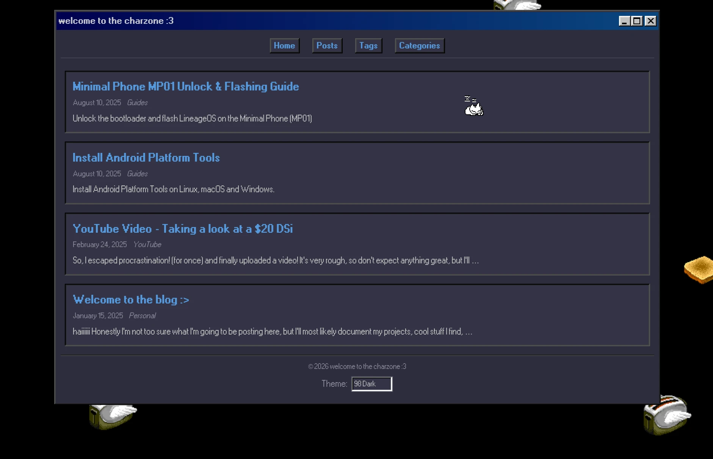

# hugo-backtothe90s

A retro "90s" blog theme for Hugo, idunno what else to really put here :P



## Getting started

Add the theme to your site:

```bash
git submodule add https://github.com/chardidathing/hugo-backtothe90s themes/hugo-backtothe90s
```

Here's a full `hugo.toml` to get you going:

```toml
baseURL = 'https://example.org/'
languageCode = 'en-us'
title = 'My Site'
theme = "hugo-backtothe90s"

[params]
  subtitle = "a cool subtitle"
  defaultTheme = "98-light"
  # bgImage = "/img/bg_pattern.gif"
  # bgMode = "tile"

[taxonomies]
  tag = "tags"
  category = "categories"

[markup]
  [markup.highlight]
    noClasses = false
    guessSyntax = true
  [markup.goldmark]
    [markup.goldmark.renderer]
      unsafe = true

[[menus.main]]
  name = "Home"
  url = "/"
  weight = 1

[[menus.main]]
  name = "Posts"
  url = "/posts/"
  weight = 2

[[menus.main]]
  name = "Tags"
  url = "/tags/"
  weight = 3

[[menus.main]]
  name = "Categories"
  url = "/categories/"
  weight = 4
```

## Example params

```toml
[params]
  # Text shown below the site title in the header
  subtitle = "a cool subtitle"

  # Default theme for new visitors
  # Options: "98-light", "98-dark", "98-charliezone", "sakura-light", "sakura-dark"
  defaultTheme = "98-light"

  # Name shown in the footer copyright. Falls back to site title if not set
  # copyright = "your name"

  # Robots meta tag value
  # robots = "index, follow"

  # Per-theme background images (optional)
  # Each theme can have its own background, or none at all
  # "tile" = repeats, good for patterns/pixel art/svgs
  # "cover" = single image, fills the screen, fixed on scroll
  # [params.backgrounds.98-charliezone]
  #   image = "/img/bg.jpg"
  #   mode = "tile"
  # [params.backgrounds.98-dark]
  #   image = "/img/stars.gif"
  #   mode = "tile"
```

## Themes

Visitors pick their theme from a dropdown in the footer. Their choice is saved in a cookie.

> yes blah blah, i should use localStorage, i was going to support old browsers but now that's a later thought,,,, will make a legacy browser branch perhaps.....

You set the default with `defaultTheme`:

| Theme | What it looks like |
|-------|-------------------|
| `98-light` | Windows 98 - teal desktop, silver windows, navy title bar |
| `98-dark` | Dark Windows 98 - with flying toasters in the background |
| `98-charliezone` | Pastel pink/mauve Windows 98 |
| `sakura-light` | Pink :3, light background |
| `sakura-dark` | Pink :3, dark background |

The 98 themes use [98.css](https://jdan.github.io/98.css/) for authentic window borders, title bars, and button styling. The sakura themes use a more traditional blog layout.

## Background image

Each theme can have its own background image. Drop your images in `static/` and add a `[params.backgrounds.<theme-name>]` block:

```toml
[params.backgrounds.98-charliezone]
  image = "/img/bg.jpg"
  mode = "tile"    # repeats the image, good for patterns

[params.backgrounds.98-dark]
  image = "/img/mountains.jpg"
  mode = "cover"   # single image, fills the screen
```

Themes without a background entry just use their solid colour.

## Posts

Posts go in `content/posts/`:

```markdown
---
title: "My Post"
date: 2025-01-15
description: "Shows up on the post list"
tags: [Hugo, Blogging]
categories: ['Guides']
draft: false
---

Your content here.
```

If your post has images, make it a folder:

```
content/posts/my-post/
  index.md
  photo.jpg
```

Then just reference images normally - `` - and they'll render as figures with captions.

## 88x31 buttons

Add as many as you want - they show up in the footer and wrap into rows.

```toml
[[params.buttons]]
  img = "/img/buttons/made-with-hugo.gif"
  url = "https://gohugo.io"
  alt = "Made with Hugo"

[[params.buttons]]
  img = "/img/buttons/netscape-now.gif"
  alt = "Best viewed in Netscape"

[[params.buttons]]
  img = "/img/buttons/anythingbutchrome.gif"
  url = "https://example.com"
  alt = "Anything but Chrome"
```

Drop your button images in `static/img/buttons/` (or wherever you like). `url` and `alt` are both optional - if you leave out `url` it just shows the image without a link. External links open in a new tab.

## Fun stuff

Every page gets a little cat ([oneko.js](https://github.com/adryd325/oneko.js)) that chases your mouse around. It'll idle, scratch itself, and fall asleep if you stop moving. Respects `prefers-reduced-motion`.

The 98 Dark theme gets [flying toasters](https://github.com/bryanbraun/after-dark-css) drifting across the background, just like the old After Dark screensaver.

## Thankyou

- [mimoex](https://github.com/mimoex/hugo-backtothe90s) for creating a really neat theme as my base!
- [jdan](https://github.com/jdan/98.css) for 98.css
- [Bryan Braun](https://github.com/bryanbraun/after-dark-css) for the flying toasters
- [adryd325](https://github.com/adryd325/oneko.js) for oneko.js

## License

MIT - see [LICENSE](LICENSE).